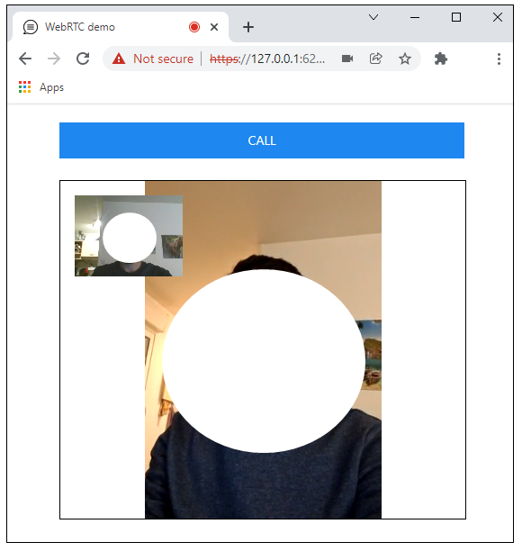
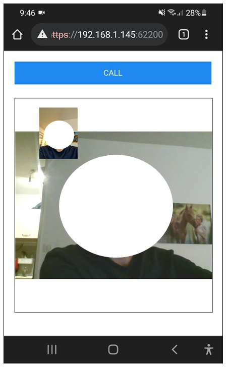

## What is this
This is a simple demonstration of WebRTC (realtime audio and video connection) in javascript, using spring websocket as signaling server.
  
## How to use
1. Build application with "mvn package -DskipTests"
2. Run application with "java -jar target/webrtc-0.0.1-SNAPSHOT.jar"
3. Connect with two clients to the server using chrome or firefox (Open https://localhost:62200/, make sure to enter the server's IP address instead of localhost in the link) (The reason of using https instead of http is that there are cases that the browsers does not make websocket connection to the servers that are not secure).
4. Click on "Call" button on one client to establish an audio and video connection)

## About
Masoud Taghavian (masoud.taghavian@gmail.com)  
Enjoy!

## Screenshots

